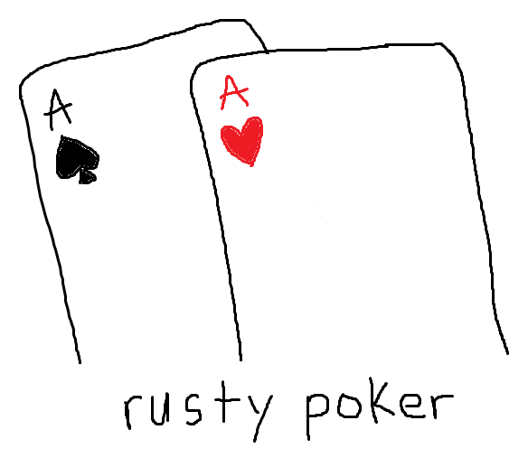

# 🃏 What Is This?
Play poker offline with different NPC difficulty levels or test your ideas by running simulations of curated situations. This project aims to recreate poker to improve my Rust skills and poker/game theory knowledge.

# ✨ Features 
- Play a normal poker game with a variety of NPC difficulties ranging from random to perfect
- Recreate situations in to test new ideas and calculate statistics

# 📋 How to Use?
### Run program
```
git clone https://github.com/p4tho04/rusty-poker
cd rusty-poker
cargo run -- <flags>
```

### Flags
|     flag      |  description  |     usage     |
| ------------- | ------------- | ------------- |
|      -p       | required: choose amount of NPCs | -p <# of NPCs> |